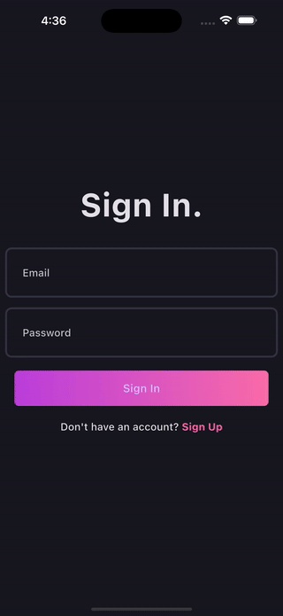

# Blog App - Flutter Clean Architecture Showcase 🚀

## 🎥 App

Check out the demo of the app in action:

This project demonstrates a **Blog App** built using **Flutter Clean Architecture**, showcasing my proficiency in developing scalable, maintainable, and testable applications. Designed with best practices, this app is an excellent example of how **Bloc**, **Supabase**, **Hive**, and **GetIt** can work together seamlessly to deliver robust solutions suitable for enterprise-level applications.

---

## 🌟 Features

- **User Authentication**
  - Login and Signup functionality to manage user sessions.
- **Blog Management**

  - View blogs with a clean and intuitive interface.
  - Add new blogs with user-friendly forms.

- **State Management**

  - Fully implemented with **Bloc** for predictable state handling.

- **Data Persistence**

  - Uses **Supabase** for backend and **Hive** for local storage.

- **Dependency Injection**
  - Powered by **GetIt** for managing dependencies effectively.

---

## 🏗️ Architecture Highlights

This app is built using **Flutter Clean Architecture**, adhering to SOLID principles and scalable design patterns:

- **Separation of Concerns**: Clear separation between UI, business logic, and data layers.
- **Reusability**: Modularized code structure for easy reuse and scalability.
- **Testability**: Independent modules for effortless unit and integration testing.

---

## 🛠️ Tech Stack

- **Framework**: Flutter
- **State Management**: Bloc
- **Backend**: Supabase
- **Local Storage**: Hive
- **Dependency Injection**: GetIt
